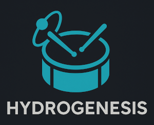

# Hydrogenesis

[Hydrogen](http://hydrogen-music.org) is great for realistic drum track generation.

[OpenMPT](https://openmpt.org) has an efficient keyboard-friendly editing experience.

Did you ever wish you could combine the two? *Well, now you can!*

Basic idea
------------------------------------------------------------------------------------------

Editing:

  * Set up Hydrogen as a MIDI back end for OpenMPT (see [this guide](./doc/setup_track.md))
  * Enjoy real-time Hydrogen [playback](./doc/playback.md) while editing in OpenMPT

Rendering:

  * Once done with editing, use [Hydrogenesis](./src/hydrogenesis.py) to [convert](./doc/conversion.md) the track to a Hydrogen song
  * Use Hydrogen to generate a sound file

(Or, maybe [screenshots](./doc/screenshots.md) is a better way of conveying the idea...)

But why?
------------------------------------------------------------------------------------------

*Q:* Why not stick to Hydrogen alone?

*A:* Because OpenMPT provides a text-based song representation and keyboard-centric editing which some of us prefer.

*Q:* Why not stick to OpenMPT alone?

*A:* Because OpenMPT does not have realistic sound generation with velocities and randomly variating samples.

User guide
------------------------------------------------------------------------------------------

Getting started:

  * [Playback](./doc/playback.md)
  * [Conversion](./doc/conversion.md)

Topics:

  * [Screenshots](./doc/screenshots.md)
  * [Features and limitations](./doc/features.md)
  * [Set up track from scratch](./doc/setup_track.md)
  * [Parser](./doc/parser.md)
  * [OpenMPT on Linux](./doc/linux.md)
