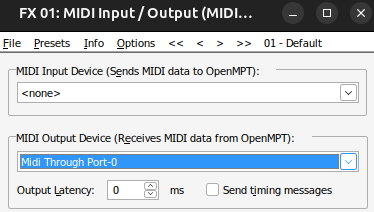

# Playback

Follow [this guide](./setup_track.md) if you want to set up an OpenMPT track from scratch. Otherwise, you can use one of the tracks in the [examples](../examples/) folder to try out playback via Hydrogen.

Play an example track
----------------------------------------------------------------------------

First, open up Hydrogen and load the template [GMRockKit_template.h2song](../examples/GMRockKit_template.h2song). The template does not contain any beats, but it ensures that the appropriate drum kit is loaded.

Next, open the track [Were_not_gonna_take_it.it](../examples/Were_not_gonna_take_it.it) in OpenMPT.

You may need to set the MIDI output for the FX1 plugin to match what Hydrogen is set up to listen to on your system.

  * Find the Plugins section on the General tab
  * Select FX1
  * Click "Editor" and set "MIDI Output Device" to the desired device\
    
    

Now, you should be able to play the track in OpenMPT and hear the sound generated from Hydrogen.
