# Set up track from scratch

This guide explains how to set up [OpenMPT](https://openmpt.org) and [Hydrogen](http://hydrogen-music.org) for live playback.

Hydrogen
------------------------------------------------------------------------------------------

Hydrogen will be used for playing notes sent from OpenMPT as MIDI events.

Start by opening up Hydrogen's MIDI settings and check that a suitable input port is selected. The following settings have been tested to work well on Ubuntu 24.04 (Hydrogen 1.2.4).

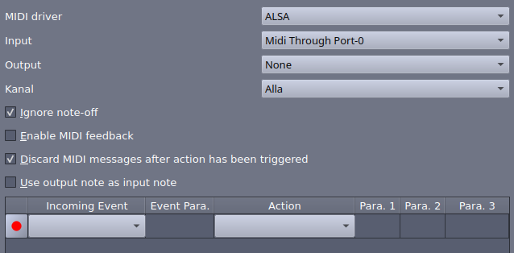

Next, create a new song and load a drum kit. Adjust mixer settings as needed.

In principle, nothing else is needed on the Hydrogen side. However, it is advised to save the song after setting up the drumkit. The resulting `.h2song` file can be used as a template by the [Hydrogenesis](../src/hydrogenesis.py) converter.

OpenMPT
------------------------------------------------------------------------------------------

We will now set up an OpenMPT track from scratch in such a way that it can be used to drive Hydrogen for playback as well as being [converted](./conversion.md) to a Hydrogen song using [Hydrogenesis](../src/hydrogenesis.py).

Start by creating a new track in OpenMPT. The default format, IT (Impulse Tracker), works fine. The [MPTM extensions](#mptm-extensions) section explains additional features offered by the MPTM format. However, the instrument set up is the same regardless of format.

### Set up instruments

We will create one OpenMPT instrument for each instrument in the Hydrogen drum kit loaded [above](#hydrogen). The instruments should appear in the same order in OpenMPT and Hydrogen.

To create the first instrument:

  * Create a new instrument
  * Name it according to the corresponding instrument in the Hydrogen drum kit

    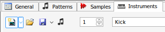 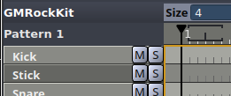

  * In the "Plugin / MIDI" section:
      - Select "FX1" in the dropdown

        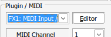

      - The plugin manager window opens. Select "MIDI Input Output" and click "Put in FX01".

        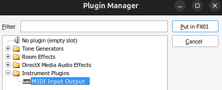

      - Click "Editor"

        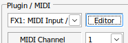

      - A settings window opens. Set "MIDI Output Device" to the same port as the MIDI input port [configured for Hydrogen](#hydrogen). Also, uncheck "Send timing messages". Timing messages are anyway ignored by Hydrogen, and they tend to bloat Hydrogen's debug log.

        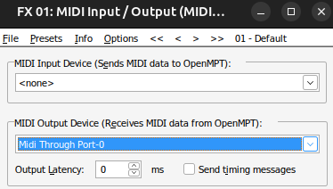

      - Set "MIDI Program" to the same index as the instrument

        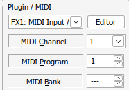 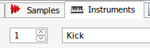

        The MIDI program index maps to the instrument index in the Hydrogen drumkit. It is possible to set MIDI program to a different index than the instrument number, and this could be useful if instruments are ordered differently in OpenMPT/Hydrogen. However, the [Hydrogenesis](../src/hydrogenesis.py) converter assumes that each instrument has the same index in both programs, so we advise sticking to that.

      - Set "Volume Command Handling" to "MIDI volume", and make sure that "Volume commands with note are Velocities" is checked

        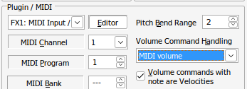

The remaining instruments can created by duplicating the first instrument as many times as needed, and just updating the name and MIDI program number for each one.

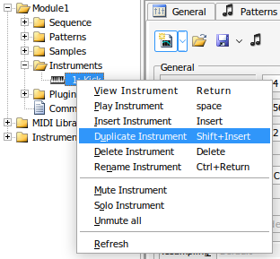
